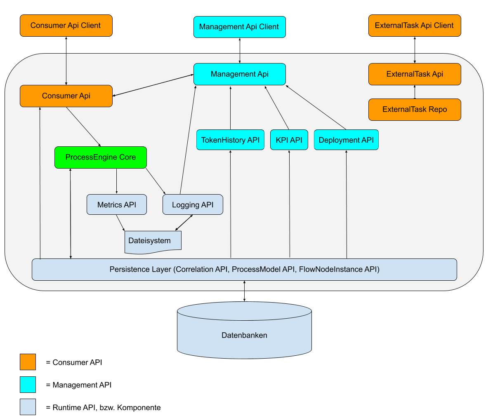
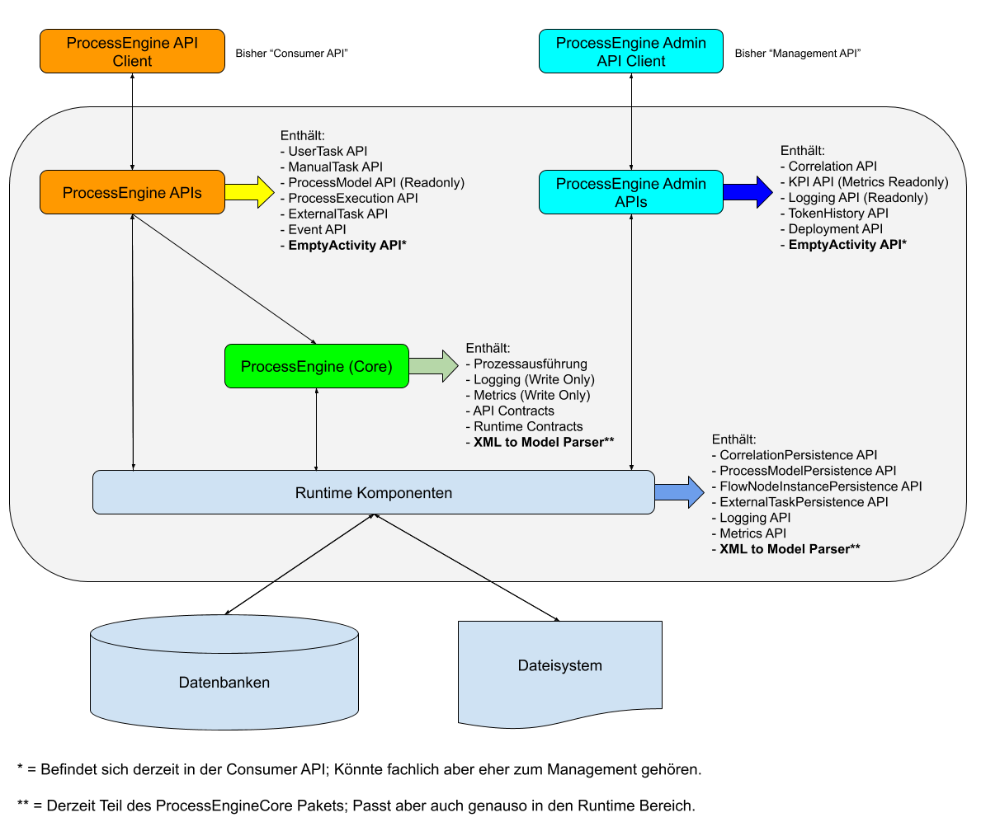

# ProcessEngine Architektur Refactoring PoC

Dieses Repository soll anhand eines kleine PoCs veranschaulichen, wie die künftige Struktur der ProcessEngine aussehen wird.

## Zusammenfassung

Konzept für die Umstrukturierung der ProcessEngine.ts nach dem Onion Modell; Zusammenlegen von Github Repositories und npm Paketen.

## Motivation

Die aktuelle Implementierung der ProcessEngine hat einen Stand erreicht, an dem es sich lohnt grundsätzliche Architektur- und Design- Entscheidungen zu überdenken und die Code Base mal etwas aufzuräumen.

Siehe aktuelles Architekturbild:

Wie auf dem Bild zu Erkennen, gibt es derzeit keine klar gezogenen Grenzen zwischen den APIs, dem ProcessEngine Core und dem Runtime Layer.
Alle Komponenten sind hart miteinander verdrahtet, teilweise begründet durch die Tatsache, dass die bisherigen Anforderungen an die ProcessEngine.ts es nicht vorsahen, die einzelnen Bereiche hart voneinander zu trennen, bzw. es zu ermöglichen sie voneinander zu trennen.

Am gravierendsten ist jedoch die Tatsache, dass die Management API die Consumer API mit implementiert.
Dies ist dem Umstand geschuldet, dass die Management API ursprünglich als “BPMN Studio only” API gedacht war und vice versa, dass das BPMN Studio keine andere API benutzen sollte.
Das hatte allerdings zur Konsequenz, dass die Management API viele Kompetenzen erhalten hat, die eigentlich für die Consumer API gedacht sind und mit dem Thema “Management” eigentlich überhaupt nichts zu tun haben. Dadurch ist keine klare Trennung der Zuständigkeiten mehr möglich und die Consumer API wirkt effektiv überflüssig.

Ein weiterer Punkt ist die Tatsache, dass viele APIs, die eigentlich Teil der Consumer- bzw. Management- API Gruppe sein sollen, vollständig alleine stehen (siehe Bild), statt direkt in die Consumer- bzw. Management- API integriert zu sein.
Das, zusammen mit der Tatsache, dass jeder Layer jedes Microservices ein eigenes Github Repository und npm Paket produziert hat, verursacht eine Menge Pflegeaufwand, welcher mit diesem Konzept reduziert werden soll.

Zuletzt soll die Namensgebung der öffentlichen APIs überdacht werden.
Es sollen Namen gefunden werden, die bereits im Vorfeld klar ausdrücken, wozu diese API eigentlich gut sein soll.
Kein Außenstehender versteht auf Anhieb, was eigentlich eine Consumer API sein soll, ohne dass man es Erklären muss. Würde diese API nun aber einfach **ProcessEngine API** heißen, kann man schon aus dem Namen heraus ableiten, dass diese API benutzt wird um mit der ProcessEngine zu kommunizieren um Prozesse auszuführen (was ja genau der Einsatzzweck der jetzigen Consumer API ist).

Gleiches gilt für die Management API, die den namen **ProcessEngine Admin API** erhalten soll.

Schaut man sich andere APIs, wie z.B. von Twitter, Facebook, etc. an, erkennt man ohnehin schnell, dass es üblich ist öffentliche APIs nach dem Produkt zu benennen, für welches sie geschrieben wurden.
Es besteht kein Grund, weshalb wir das nicht genauso machen sollten.

## Erläuterung

### Zusammenfassung

Folgendes Schaubild soll die künftige Architektur veranschaulichen:

_Zur Erklärung:_

Die neue Architektur wird sich an dem Onion-Modell orientieren.
Die jetzigen Core Pakete werden dabei auch hierfür den Kern bilden.
Alle anderen Komponenten werden um den Core herum gebildet und entsprechend zugeschnitten.

### Public APIs

Es wird 2 öffentliche APIs für den Zugriff auf die ProcessEngine geben:

1. **ProcessEngine API** (ehemals Consumer API):

- Erlaubt das Abfragen und Ausführen von Prozessmodellen
- Erlaubt das Abfragen von Ergebnissen von Prozessinstanzen
- Verwaltet laufende UserTasks und ManualTasks
- Steuert die Ausführung von ExternalTasks
- Erlaubt es Signale und Messages zu senden
- Evtl. auch Handling von untypisierten Activities (muss noch geklärt werden)

2. **ProcessEngine Admin API** (ehemals Management API):

- Beinhaltet lediglich administrative Aufgaben
- Deployed & Löscht Prozessmodelle
- Verwaltungstools für Correlations
- Erstellt KPIs auf Basis von erfassten Metriken
- Liefert Logs zu ausgeführten Prozessinstanzen
- Liefert die TokenHistory von Prozessinstanzen
- Evtl. auch Handling von untypisierten Activities (muss noch geklärt werden)

Beide APIs werden künftig in jeweils **einem** Github Repository zusammen gefasst.
Alle bestehenden Consumer APIs und Management APIs werden in diese beiden APIs fest integriert, so dass es am Ende nur noch 2 APIs geben wird.
Wird eine neue Fachlichkeit benötigt (z.B. Handling von Business Rule Tasks, oder DNM Diagrammen), wird diese als neue Komponente in **eine** dieser APIs integriert.

Der interne Zuschnitt dieser APIs kann durchaus auf mehrere Klassen aufgeteilt werden (z.B. einen UserTaskService, ManualTaskService, ProcessModelService, etc.), das Endprodukt soll jedoch ein einzelnes sein.


### API Clients

Was die API Clients betrifft, so ergeben sich folgende Änderungen:

**ExternalTaskApiClient** und **ConsumerApiClient** werden zum **ProcessEngineClient** zusammengefasst.

Der **ManagementApiClient** wird in **ProcessEngineAdminClient** umbenannt und behält seine bisherigen Funktionalitäten bei.

Die Accessors für beide Clients werden ersatzlos abgeschafft.
Stattdessen wird es jeweils zwei separate Clients geben:

- Einen für den Zugriff auf eine in die Anwendung integrierte ProcessEngine
- Einen für den Zugriff auf eine externe ProcessEngine per HTTP

Ursprünglich sollten die Accessors dabei behilflich sein, Änderungen in einer externen Anwendung auf ein Minimum zu reduzieren, falls sich die Art und Weise ändert in welcher diese mit einer ProcessEngine kommuniziert.

Das Konzept hat sich jedoch in der Praxis nicht bewährt und wird nun entsprechend erneuert.

### ProcessEngine Core

Der Process Engine Core bildet das Herzstück des Ganzen und erfüllt folgende Aufgaben:
Ausführung von Prozessmodellen
Im Rahmen dessen werden auch Metriken und Logs generiert und an entsprechende APIs aus der Runtime zur Verarbeitung weitergereicht
Bereitstellen von Contracts für die öffentlichen APIs und die Runtime Komponenten

Aktuell befindet sich auch der Model Parser im Core Paket, welcher die BPMN Diagramme in ein für Node lesbares Format konvertiert.
Das wäre zwar auch für die neue Struktur passend, aber es könnte sich ggf. anbieten, dieses Modul in eine Runtime Komponente zu verlagern.

### Runtime Komponenten

Die Runtime Komponenten (Datenbankzugriff, Logging, Metrics, FileSystem Access, etc.) sind in der Grafik in einer Schicht zusammengefasst.
Es steht noch zur Diskussion inwieweit eine Aufteilung auf GitHub erfolgen wird.
Ich halte es jedoch für empfehlenswert, die jetzige Aufteilung weitestgehend beizubehalten und nur die jeweiligen APIs in ein GitHub Repository zusammenzufassen, so wie es auch bei der ProcessEngine API und ProcessEngine Admin API passieren soll.

Wie der Paketzuschnitt bei npm aussehen wird, muss noch diskutiert werden.
Persönlich favorisiere ich die jetzige Struktur, in welcher Endpoints, Services, Contracts, Use Cases und Repositories jeweils ein eigenes Paket darstellen.
Das garantiert uns eine maximale Austauschbarkeit, was besonders für die Runtime Komponenten sehr wichtig sein wird.

## Nachteile des Vorschlags

- Reduzierte Skalierbarkeit, dadurch dass die APIs gruppiert werden.
- Größere Sorgfalt beim Verwalten der Github Branches notwendig, da die PRs größer werden und Dinge wie Merge Konflikte häufiger auftreten werden.
- Es ist fraglich inwieweit noch ausreichend passende Paketnamen bei npm verfügbar sind. Eine neue Orga könnte evtl. notwendig sein.

## Begründung und Alternativen

Die Refaktorisierung soll folgende Ziele erfüllen:

- Reduzierung des Verwaltungsaufwandes auf Github und npm
- Aufräumen der API Implementierungen, insbesondere Management API
- Klare Grenzen der Kompetenzen zwischen den einzelnen APIs
- Zentralisierung der Contracts
- Intuitive Benennungen der Public APIs um Außenstehenden den Zugang zu erleichtern
- Einfacher Zugang für Entwickler, die die PE verwenden wollen

## Ungeklärte Fragen

Folgende Fragen sind noch zu klären:

- Finale GitHub Repository Struktur?
- Finaler Paketzuschnitt bei npm?
- Welche API wird final für die Ausführung der untypisierten Activites zuständig sein?
- Evtl. neue Orga aufsetzen, da viele Paketnamen bei npm mittlerweile belegt sind?
- Könnte man die Pakete aus @essential-projects evtl. direkt mit in die Runtime Komponenten von @process-engine integrieren?
    - Nicht wichtig für dieses Refactoring, jedoch sind gut ¾ der Repositories in @essential-projects mittlerweile archiviert, so dass sich die Frage stellt, inwieweit es überhaupt Sinn macht diese Orga weiter zu pflegen.

Ebenfalls gilt es noch zu klären inwieweit die Komponenten (Public APIs, ProcessEngine, Runtime Layer) voneinander getrennt werden.
Erfolgt nur eine logische Trennung, anhand von NPM Paketen und/oder Github Repositories, so kann dies ohne großen Mehraufwand geschehen.
“Logisch” bedeutet in diesem Zusammenhang, dass die Pakete an unterschiedlichen Orten liegen, aber trotzdem z.B. per IoC in einer zentralen Anwendung zusammengeknotet werden. Die derzeitige ProcessEngineRuntime erledigt dies.
Die ProcessEngine API würde dann weiterhin die Services des ProcessEngine Cores und der Runtime direkt injected bekommen und es wären keine weiteren Kommunikationskanäle notwendig.

Eine Beispielstruktur könnte so aussehen:

- ProcessEngine API - UserTaskService
    - Bekommt die Services aus dem ProcessEngine Core injected
        - Diese bekommen die Services aus der Runtime injected

Alle Komponenten befinden sich in der gleichen Anwendung und im gleichen IoC Container.

Es stand jedoch im letzten Meeting zur Diskussion alle Komponenten hart voneinander zu trennen.
Sollte dies zur Anforderung werden, gilt es noch auszuarbeiten, wie eine Kommunikation zwischen diesen erfolgen kann:

- Wie können die APIs mit dem ProcessEngine Core kommunizieren?
- Wie kommuniziert der Core mit den Runtime APIs?
- Welche Schnittstellen müssen ProcessEngine Core und die Runtime APIs bereitstellen?
