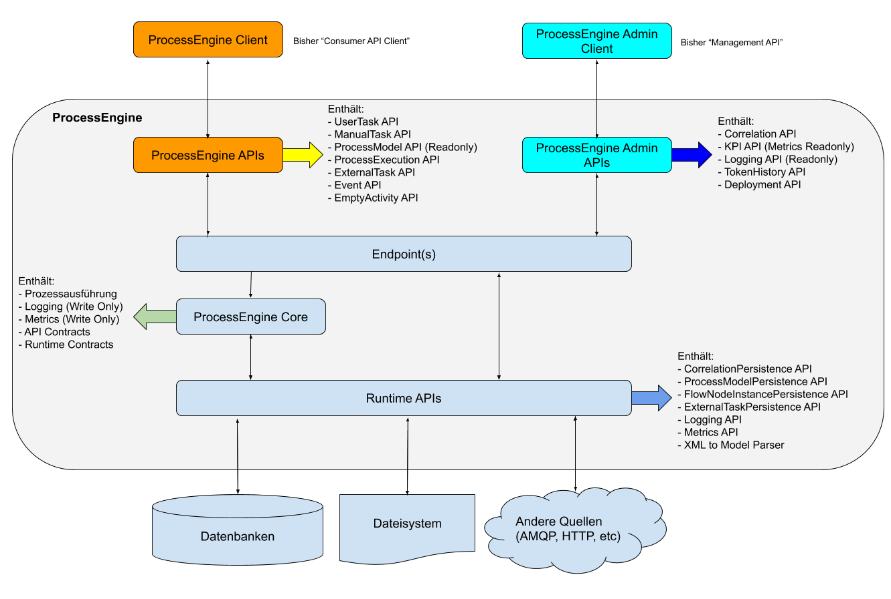

# ProcessEngine Architektur Refactoring PoC

Dieses Repository soll anhand eines kleine PoCs veranschaulichen, wie die künftige Struktur der ProcessEngine aussehen wird.

## Zusammenfassung

Konzept für die Umstrukturierung der ProcessEngine.ts nach dem Onion Modell; Zusammenlegen von Github Repositories und npm Paketen.

## Motivation

Die aktuelle Implementierung der ProcessEngine hat einen Stand erreicht, an dem es sich lohnt grundsätzliche Architektur- und Design- Entscheidungen zu überdenken und die Code Base mal etwas aufzuräumen.

Siehe aktuelles Architekturbild:

Wie auf dem Bild zu Erkennen, gibt es derzeit keine klar gezogenen Grenzen zwischen den APIs, dem ProcessEngine Core und dem Runtime Layer.
Alle Komponenten sind hart miteinander verdrahtet, teilweise begründet durch die Tatsache, dass die bisherigen Anforderungen an die ProcessEngine.ts es nicht vorsahen, die einzelnen Bereiche hart voneinander zu trennen, bzw. es zu ermöglichen sie voneinander zu trennen.

Am gravierendsten ist jedoch die Tatsache, dass die Management API die Consumer API mit implementiert.
Dies ist dem Umstand geschuldet, dass die Management API ursprünglich als “BPMN Studio only” API gedacht war und vice versa, dass das BPMN Studio keine andere API benutzen sollte.
Das hatte allerdings zur Konsequenz, dass die Management API viele Kompetenzen erhalten hat, die eigentlich für die Consumer API gedacht sind und mit dem Thema “Management” eigentlich überhaupt nichts zu tun haben. Dadurch ist keine klare Trennung der Zuständigkeiten mehr möglich und die Consumer API wirkt effektiv überflüssig.

Ein weiterer Punkt ist die Tatsache, dass viele APIs, die eigentlich Teil der Consumer- bzw. Management- API Gruppe sein sollen, vollständig alleine stehen (siehe Bild), statt direkt in die Consumer- bzw. Management- API integriert zu sein.
Das, zusammen mit der Tatsache, dass jeder Layer jedes Microservices ein eigenes Github Repository und npm Paket produziert hat, verursacht eine Menge Pflegeaufwand, welcher mit diesem Konzept reduziert werden soll.

Zuletzt soll die Namensgebung der öffentlichen APIs überdacht werden.
Es sollen Namen gefunden werden, die bereits im Vorfeld klar ausdrücken, wozu diese API eigentlich gut sein soll.
Kein Außenstehender versteht auf Anhieb, was eigentlich eine Consumer API sein soll, ohne dass man es Erklären muss. Würde diese API nun aber einfach **ProcessEngine API** heißen, kann man schon aus dem Namen heraus ableiten, dass diese API benutzt wird um mit der ProcessEngine zu kommunizieren um Prozesse auszuführen (was ja genau der Einsatzzweck der jetzigen Consumer API ist).

Gleiches gilt für die Management API, die den namen **ProcessEngine Admin API** erhalten soll.

Schaut man sich andere APIs, wie z.B. von Twitter, Facebook, etc. an, erkennt man ohnehin schnell, dass es üblich ist öffentliche APIs nach dem Produkt zu benennen, für welches sie geschrieben wurden.
Es besteht kein Grund, weshalb wir das nicht genauso machen sollten.

## Erläuterung

### Zusammenfassung

Folgendes Schaubild soll die künftige Architektur veranschaulichen:

_Zur Erklärung:_

Die neue Architektur wird sich an dem Onion-Modell orientieren.
Die jetzigen Core Pakete werden dabei auch hierfür den Kern bilden.
Alle anderen Komponenten werden um den Core herum gebildet und entsprechend zugeschnitten.

### Public APIs

Es wird 2 öffentliche APIs für den Zugriff auf die ProcessEngine geben:

1. **ProcessEngine API** (ehemals Consumer API):

- Erlaubt das Abfragen und Ausführen von Prozessmodellen
- Erlaubt das Abfragen von Ergebnissen von Prozessinstanzen
- Verwaltet laufende UserTasks und ManualTasks
- Steuert die Ausführung von ExternalTasks
- Erlaubt es Signale und Messages zu senden
- Evtl. auch Handling von untypisierten Activities (muss noch geklärt werden)

2. **ProcessEngine Admin API** (ehemals Management API):

- Beinhaltet lediglich administrative Aufgaben
- Deployed & Löscht Prozessmodelle
- Verwaltungstools für Correlations
- Erstellt KPIs auf Basis von erfassten Metriken
- Liefert Logs zu ausgeführten Prozessinstanzen
- Liefert die TokenHistory von Prozessinstanzen
- Evtl. auch Handling von untypisierten Activities (muss noch geklärt werden)

Beide APIs werden künftig in jeweils **einem** Github Repository zusammen gefasst.
Alle bestehenden Consumer APIs und Management APIs werden in diese beiden APIs fest integriert, so dass es am Ende nur noch 2 APIs geben wird.
Wird eine neue Fachlichkeit benötigt (z.B. Handling von Business Rule Tasks, oder DNM Diagrammen), wird diese als neue Komponente in **eine** dieser APIs integriert.

Der interne Zuschnitt dieser APIs kann durchaus auf mehrere Klassen aufgeteilt werden (z.B. einen UserTaskService, ManualTaskService, ProcessModelService, etc.), das Endprodukt soll jedoch ein einzelnes sein.

### API Clients

Was die API Clients betrifft, so ergeben sich folgende Änderungen:

ConsumerApiClient und ExternalTaskApiClient werden zum ProcessEngineClient zusammengefasst.

Der ManagementApiClient wird in ProcessEngineAdminClient umbenannt und behält seine bisherigen Funktionalitäten bei.

Die Accessors für beide Clients werden ersatzlos abgeschafft.
Stattdessen wird es jeweils zwei separate Clients geben:

- Einen für den Zugriff auf eine in die Anwendung integrierte ProcessEngine
- Einen für den Zugriff auf eine externe ProcessEngine per HTTP

Der Client für externe ProcessEngines sollte zudem selbst dafür sorgen, dass der von ihm benötigte HttpClient korrekt initialisiert wird.
Bisher wird erwartet, dass ein vollständig initialisierter HttpClient per IoC injected wird. Das ist jedoch wenig Benutzerfreundlich, nicht zuletzt auch deswegen, da so ein doppelter Pflegeaufwand für die Config betrieben werden muss (eine Config für den ProcessEngineClient und eine für den HttpClient).

Ursprünglich sollten die Accessors dabei behilflich sein, Änderungen in einer externen Anwendung auf ein Minimum zu reduzieren, falls sich die Art und Weise ändert in welcher diese mit einer ProcessEngine kommuniziert.

Das Konzept hat sich jedoch in der Praxis nicht bewährt und wird nun entsprechend erneuert.

### ProcessEngine Core

Der Process Engine Core bildet das Herzstück des Ganzen und erfüllt folgende Aufgaben:
Ausführung von Prozessmodellen
Im Rahmen dessen werden auch Metriken und Logs generiert und an entsprechende APIs aus der Runtime zur Verarbeitung weitergereicht
Bereitstellen von Contracts für die öffentlichen APIs und die Runtime Komponenten

Aktuell befindet sich auch der Model Parser im Core Paket, welcher die BPMN Diagramme in ein für Node lesbares Format konvertiert.
Das wäre zwar auch für die neue Struktur passend, der Konsistenz wegen sollte dieser jedoch in einen Runtime Service ausgelagert werden.

### Runtime Komponenten

Die Runtime Komponenten (Datenbankzugriff, Logging, Metrics, FileSystem Access, etc.) sind in der Grafik in einer Schicht zusammengefasst.

Die bestehenden Runtime APIs werden wie folgt zusammengeführt:

- **Persistence API**: Beinhaltet alle Datenbankorientierten APIs (Correlation, FlowNodeInstance, ExternalTask und ProcessModel)
- **Logging**: Schreibt und liest Logging Daten auf das Dateisystem
- **Metrics**: Schreibt und liest Metriken auf das Dateisystem

Da Logs und Metriken bevorzugt in Dateien auf dem lokalen Dateisystem abgelegt und in der Regel nach dem “Fire & Forget” Prinzip generiert werden, würde ich es nicht für richtig erachten, diese mit in die Persistence API zu integrieren.

Die Datenbank orientierten APis können zu einer API zusammengefasst werden, da es sehr unwahrscheinlich ist, dass wir jemals eine ProcessEngine releasen werden, die **nicht** die gesamte Persistenzschicht bereitstellt. Auf der anderen Seite reduziert eine Zusammenlegung der APIs den Pflegeaufwand jedoch erheblich.

Ebenfalls sollen die Funktionen der Persistence API auf das wesentliche reduziert werden.
Aktuell ist es noch so, dass sämtliche UseCases, die von den der Consumer API und Management API benötigt werden, bis in den Persistence Layer durch programmiert wurden.
Besonders in der FlowNodeInstance API befinden sich dadurch zahlreiche UseCases, die weit über das übliche CRUD hinausgehen.

Um den Pflegeaufwand für die Persistence API auf ein Minimum zu reduzieren, soll die Persistence API künftig nur noch die grundlegenden CRUD Funktionen bereitstellen (es kann hier sicherlich auch Ausnahmen geben, diese sind jedoch stets zu begründen!).
Datenfilterung, Sortierung, etc. soll von den aufrufenden APIs selbst durchgeführt werden.

Sollten weitere APIs nötig werden, gilt es zu entscheiden, ob sich eine Integration in die **Persistence API** anbietet, oder ob es vorteilhafter ist diese in eine eigene API zu fassen.

APIs die Daten in Datenbanken schreiben, sollten in die Persistence API mit aufgenommen werden.
Alle weiteren APIs sollten eigenständige APIs darstellen  - z.B. die auf der Roadmap stehenden **Messagebus API** und **FileUpload API**.

### Paketzuschnitt

Auf GitHub wird es 4 Hauptrepositories geben:

- ProcessEngineApi
- ProcessEngineAdminAPi
- ProcessEngineCore
- ProcessEngineRuntime

Die in diesen Repositories befindlichen APis werden den bei uns etablierten Standard Zuschnitt bekommen, sprich:

- **Service**: Für die Kernfunktionalitäten
- **UseCase**: Für Service-übergreifende Operationen
- **Repository**: Für den Zugriff auf Datenquellen
- **Endpoint**: Um externen Komponenten den Zugriff auf die API zu ermöglichen

Jeder Layer einer jeden API Stellt dabei ein eigenes NPM Paket dar. 

## Nachteile des Vorschlags

- Reduzierte Skalierbarkeit, dadurch dass die APIs gruppiert werden.
- Größere Sorgfalt beim Verwalten der Github Branches notwendig, da die PRs größer werden und Dinge wie Merge Konflikte häufiger auftreten werden.
- Es ist fraglich inwieweit noch ausreichend passende Paketnamen bei npm verfügbar sind. Eine neue Orga könnte evtl. notwendig sein.

## Begründung und Alternativen

Die Refaktorisierung soll folgende Ziele erfüllen:

- Reduzierung des Verwaltungsaufwandes auf Github und npm
- Aufräumen der API Implementierungen, insbesondere Management API
- Klare Grenzen der Kompetenzen zwischen den einzelnen APIs
- Zentralisierung der Contracts
- Intuitive Benennungen der Public APIs um Außenstehenden den Zugang zu erleichtern
- Einfacher Zugang für Entwickler, die die PE verwenden wollen

## Ungeklärte Fragen

Derzeit keine ungeklärten Fragen vorhanden.
